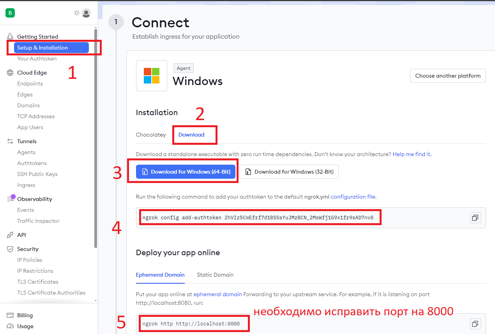

# salary_aggregate_bot
Асинхронный бот, агрегирующий зарплаты за указанный период, 
по указанному типу группировки. MongoDB, aiogram, fastapi, uvicorn

Тесты:

Вебхуки
Для локальной разработки потребуется имитация публичного ip, в связи с тем, что сервер телеграма отправляет запросы на публичный сервер. Для этого использовал ngrok